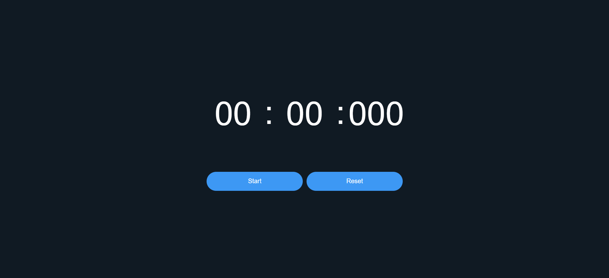

# ⏱️ AetherTime - Stopwatch Web Application

A simple and responsive stopwatch built using **HTML**, **CSS**, and **JavaScript**, which tracks **minutes**, **seconds**, and **milliseconds** in real-time. This project is ideal for practicing basic DOM manipulation, timing functions, and UI styling.

## Live Demo
👉[View Live Project](https://shubham-kumar012.github.io/Projects/aether-time/)


## 🚀 Features

- Start, Stop, and Reset functionality
- Displays time in `MM : SS : MS` format
- Real-time update every 10 milliseconds
- Responsive and clean UI

## Technologies Used

- **HTML** – Structure of the webpage
- **CSS** – Styling and layout
- **JavaScript** – Logic for stopwatch timing and controls

## Preview



> Replace this with a real screenshot of your app (you can take it from your browser)


## How It Works
- Start button triggers the setInterval() to update time every 10ms.

- Stop button clears the interval to pause the stopwatch.

- Reset button sets all values to zero and stops the timer.

- Time is calculated and updated by tracking milliseconds, seconds, and minutes using JavaScript.

## Concepts Used
- setInterval() and clearInterval() and Date.now()

- DOM manipulation (document.getElementById, innerText)

- CSS Flexbox for layout

- Event listeners for button controls

## How to Use
Clone the repository
```bash
git clone https://github.com/shubham-kumar012/Projects.git 
```
Navigate to the project folder
```
cd Projects/aether-time
```
Open `index.html` in your browser
```
start index.html
```

