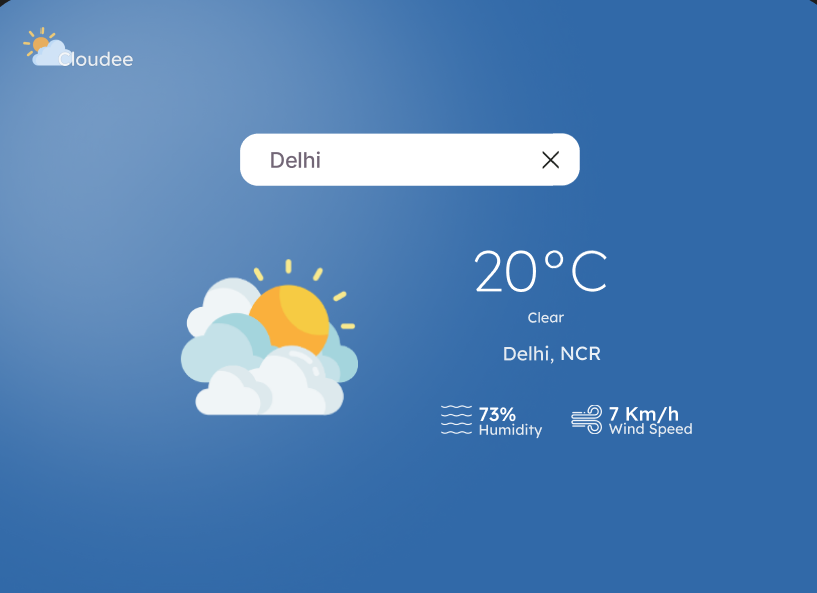
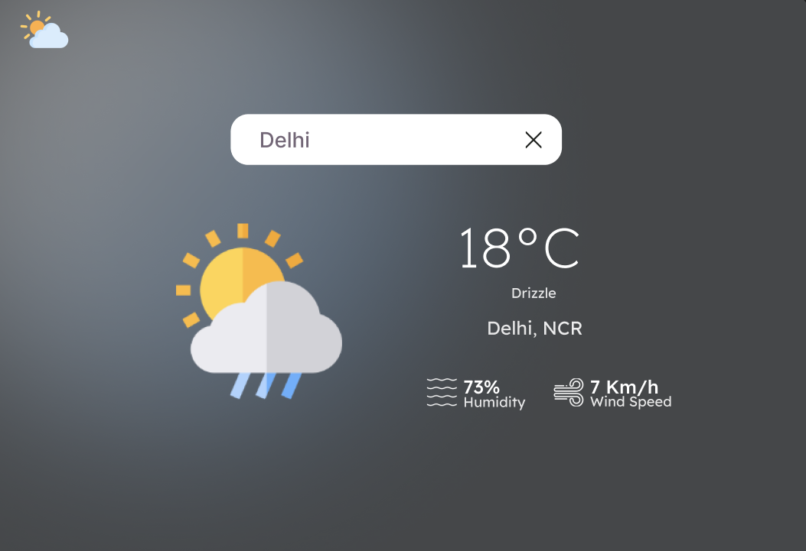
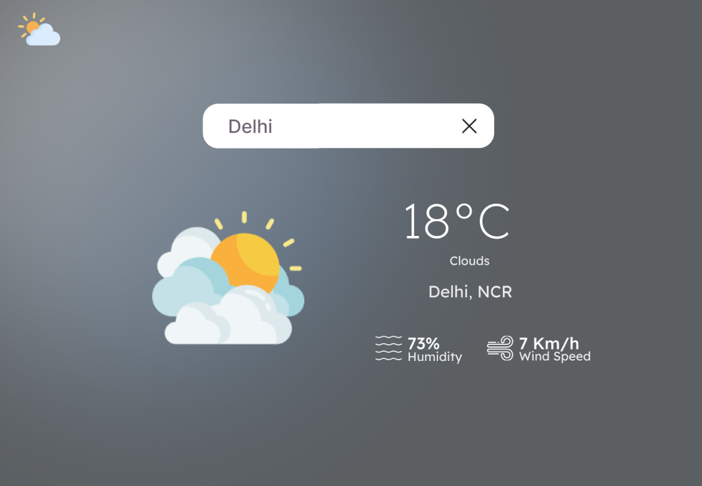

# ⛅Cloudee - Weather Web App

This is a simple and responsive weather web app that I built using ***HTML***, ***CSS***, and ***JavaScript***. It shows real-time weather updates by fetching data from the OpenWeather API, with the help of ***Axios*** for API requests. The design is clean, user-friendly, and looks good on all screen sizes — inspired by a layout I first created in Figma.

---
#  Live Demo

Check the live version here: [Click here](https://shubham-kumar012.github.io/Projects/cloudee/)

---
## Features

-  Get real-time weather data for any city
-  Fully responsive design (mobile, tablet, desktop)
- API integration using **Axios**
- UI designed to be smooth, clean, and easy on the eyes
-  Displays temperature, humidity, wind, and weather conditions
- Search functionality with instant results

---

## 📸 Preview






---

## 🚀 Technologies Used

- **HTML5**
- **CSS3** (Flexbox + Responsive Design)
- **JavaScript (ES6+)**
- **Axios** (for API calls)
- **OpenWeather API** (https://openweathermap.org/api)
- **Figma** (for initial UI design)

---

##  API Used

- [OpenWeather API](https://openweathermap.org/current)  
  Used to fetch current weather data based on city name.

---

## How to Run Locally

1. Clone the repository:
   ```bash
   git clone https://github.com/your-username/your-repo-name.git

2. Open the index.html file in your browser.
- Make sure to insert your own OpenWeather API key in the JavaScript file:
```bash
const apiKey = "YOUR_API_KEY";

